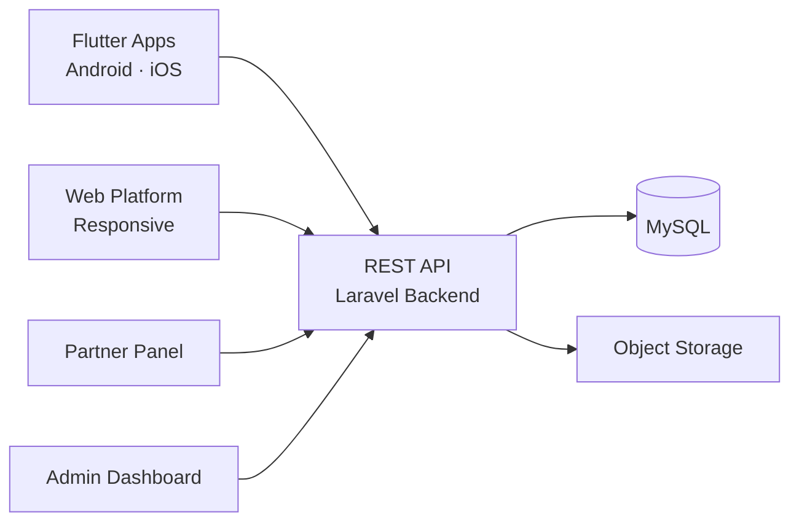

# Bolt Clone — White-Label Solution by Miracuves

---

## Table of Contents

1. [Who Is This For?](#who-is-this-for)
2. [How It Works](#how-it-works)
3. [Core Features](#core-features)
4. [Architecture](#architecture)
5. [Revenue Streams](#revenue-streams)
6. [What's Included](#whats-included)
7. [Deployment Timeline](#deployment-timeline)
8. [Why Not Build From Scratch?](#why-not-build-from-scratch)
9. [Market Opportunity](#market-opportunity)
10. [Client Testimonials](#client-testimonials)
11. [FAQ](#faq)
12. [Resources](#resources)
13. [About Miracuves](#about-miracuves)

## Live Demos

| Environment | URL | What you can test |
|---|---|---|
| Web Platform | [mxuber.mimeld.com](https://mxuber.mimeld.com) | Full experience in the browser |
| Mobile App (Android) | [mas.mimeld.com](https://mas.mimeld.com) | Browse, transact, engage |
| Admin Dashboard | [Solution page → Demo](https://miracuves.com/bolt-clone/#demo) | Users, content, plans, analytics |

Demo credentials: [miracuves.com/bolt-clone -> Demo section](https://miracuves.com/bolt-clone/#demo)

## What Makes This Bolt Clone Different

<!-- TODO: fill 3-5 vertical-specific differentiators -->

## Who Is This For?

| Buyer Type | Use Case |
|---|---|
| Startup Founders | Launch a ride-hailing brand in a new city or country |
| Micro-Mobility Operators | Add e-scooter and e-bike rentals to your platform |
| Agencies / Resellers | White-label and deliver to your own clients |
| Regional Operators | Compete with Uber/Bolt in underserved markets |

---

## How It Works

1. Rider opens the app and selects ride type or nearby e-scooter
2. For ride-hailing: nearest driver is matched and dispatched
3. For micro-mobility: QR code unlocks the vehicle with automated billing
4. Driver or rider navigates to destination via optimized route
5. Payment is processed automatically from wallet or card
6. Trip completes; ratings and feedback are exchanged

---

## Core Features

### Passenger App
- Ride request
- Fare estimate
- Live GPS tracking
- Multiple payment options
- Saved places
- Ride history
- Ratings & feedback
- Split fare

### Driver App
- Ride accept/reject
- GPS navigation
- Earnings dashboard
- Driver ratings
- Online/offline toggle

### Admin Panel
- Driver onboarding
- Fleet management
- Dynamic pricing
- Zone management
- Analytics

---

## Advanced Features

The platform integrates AI-powered features that reduce manual overhead and capture revenue opportunities:

- **AI Demand Forecasting** - Predicts peak zones and demand spikes so drivers are positioned before demand hits
- **AI Route Optimization** - Calculates the fastest route accounting for traffic, weather, and road closures
- **AI Surge Pricing** - Dynamic pricing engine that adjusts fares based on real-time supply and demand
- **AI Driver Scorecards** - Analyzes driver behavior and route performance for automated quality control
- **AI Dynamic Pricing** - Real-time surge pricing based on demand
- **AI Driver Allocation** - Smartest driver assignment
- **AI ETA Prediction** - Accurate arrival estimates

---

## Apps and Web Panels

| Module | Description |
|---|---|
| Rider App (iOS + Android) | Booking, tracking, payments, ratings |
| Driver App (iOS + Android) | Trip acceptance, navigation, earnings |
| Admin Web Panel | Dispatch, fleet, pricing, users, reports |

---

## Architecture

**Stack:**

| Layer | Technology |
|---|---|
| Mobile Apps | Flutter (iOS + Android, single codebase) |
| Backend API | Node.js + Express |
| Database | MongoDB |
| Real-time | WebSockets (Socket.io) |
| Maps and Navigation | Google Maps API / Mapbox |
| Payments | Stripe, Razorpay, PayPal, Braintree |
| Notifications | Firebase Cloud Messaging (FCM) |
| Cloud Hosting | AWS / DigitalOcean / Contabo VPS |
| Admin Panel | React.js |

---

## Revenue Streams

The platform is engineered to generate revenue from day one through multiple complementary channels:

- **Commission per ride** - take 15-25% from each trip
- **Driver subscription** - weekly or monthly fee for platform access
- **Surge pricing margin** - higher revenue during peak demand
- **E-scooter rental fees** - per-minute or per-day rental charges
- **Corporate accounts** - B2B contracts for employee transport
- Commission per ride (15-25%)
- Surge pricing revenue
- Driver subscription
- Cancellation fees
- In-app advertising

---

## Security and Compliance

- OTP-based authentication
- SSL/TLS encrypted API communication
- GDPR-ready data handling

---

## What's Included

| Plan | Price | What You Get |
|---|---|---|
| Standard | **$2,899** | Complete source code, all apps, admin panel, rebranding, 1 year updates |
| Enterprise | Custom Quote | Everything in Standard + custom features, multi-region, priority support |

**What is included:**

- Rider App (iOS + Android)
- Driver App (iOS + Android)
- Admin Web Panel
- Full Source Code
- Complete Rebranding (your logo, colors, app name)
- Server Deployment
- App Store and Google Play Submission Support
- 60 Days Free Bug Support
- Free 1-Year Updates

---
**Pricing:** from **$2,899** — transparent on the [solution page](https://miracuves.com/bolt-clone/#pricing).

## Deployment Timeline

| Day | Milestone |
|---|---|
| Day 1 | Server setup, environment configuration, initial deployment |
| Day 2 | White-labeling - app name, logo, colors, splash screens |
| Day 3 | Payment gateway integration + third-party API configuration |
| Day 4 | Custom feature implementation (if applicable) |
| Day 5 | QA, testing, bug fixes across all panels |
| Day 6 | App Store + Google Play submission + Go-live |

> **Average go-live: 6 business days from payment confirmation.**

---

## Why Not Build From Scratch?

| Factor | Build from Scratch | Miracuves Solution |
|---|---|---|
| Time to Launch | 6-12 months | 6 days |
| Development Cost | $60,000-$150,000 | From $2,899 |
| Source Code Ownership | Yes | Yes |
| Customization | Full | Full |
| Post-Launch Support | Depends on team | 60 days included |
| Risk | High | Low |

---

## Market Opportunity

| Metric | Data |
|---|---|
| Global Ride-Hailing Market (2024) | $96 billion |
| Projected Market Size (2030) | $240 billion |
| CAGR | ~14% |
| Key Growth Markets | India, USA, SEA, MENA, Africa, LatAm |
| Micro-Mobility Segment Growth | ~20% CAGR |

> Source: Statista, Grand View Research, Allied Market Research

---

## Successful Verticals

- City ride-hailing (competing with Uber, Bolt locally)
- E-scooter and e-bike rental networks
- Corporate employee transport
- Bike taxi and auto-rickshaw booking
- Daily commute
- Airport transfers
- Corporate travel
- Food delivery
- Package delivery

---

## Client Testimonials

> *"The micro-mobility integration was a game-changer. Our users love switching between ride-hailing and e-scooters in one app."*
> - Founder, Mobility Platform

> *"Exceptional results from day one."*
> - Verified Client

> *"Scaled 3x faster than expected."*
> - Startup Founder

---

## FAQ

**How much does a Bolt clone cost?**
A white-label Bolt clone from Miracuves starts at $2,899 with complete source code ownership.

**Does it support e-scooters and e-bikes?**
Yes. Micro-mobility rentals with QR code unlock and per-minute billing are included.

**Can I run ride-hailing and food delivery on one platform?**
Yes. The platform supports multi-service expansion.

**Do I get the source code?**
Yes. Complete source code ownership is included.

**How long does it take to launch?**
6 business days from payment confirmation.

---

## Related Solutions

Explore our other white-label clone solutions:

- [Uber Clone - Ride-Hailing](https://github.com/Miracuves-Solutions/Uber-Clone)
- [Lyft Clone - Ride-Sharing](https://github.com/Miracuves-Solutions/Lyft-Clone)
- [inDrive Clone - Negotiable Rides](https://github.com/Miracuves-Solutions/inDrive-Clone)

---

## Resources

- [Full Solution Page](https://miracuves.com/bolt-clone/) — features, pricing, demos, FAQ

## Get Started

**Ready to launch your ride-hailing business?**

| Channel | Link |
|---|---|
| Full Solution Page | [miracuves.com/bolt-clone](https://miracuves.com/bolt-clone/) |
| Email | info@miracuves.com |
| WhatsApp | [+91 98300 09649](https://wa.me/919830009649) |
| Book a Call | [Free Consultation](https://miracuves.com/contact/) |

---

## About Miracuves

**Miracuves Solutions Pvt. Ltd.** is a Mumbai-based software company specializing in white-label clone app solutions across 12+ industries.

- 90+ ready-to-deploy solutions
- 6-day delivery guarantee
- 60+ engineers on staff
- 3,900+ apps delivered
- Full source code ownership
- Clients across 40+ countries including India and USA

[Explore all 90+ solutions at miracuves.com](https://miracuves.com)

---

## Disclaimer

This product is independently developed by Miracuves. All product names, logos, and brands are property of their respective owners. Use of these names does not imply endorsement.

---

*(c) 2026 Miracuves Solutions Pvt. Ltd. | Mumbai, India*
*This repository contains product documentation only - no proprietary source code is published here.*

*Keywords: bolt clone, bolt script, white label solution, laravel flutter app, clone script*

---

### Note on This Repository

This repository is a product overview. The full source code is delivered to clients on purchase. For a hands-on evaluation, use the live demos above; credentials are public on the solution page.

<!--
=========================================================
GENERATED FROM MIRACUVES NETFLIX-CLONE README TEMPLATE
Canon: 6 working days, from $2,799 floor, 60 days support + 12 months updates.
Never use 3 days. See https://miracuves.com/facts/ for audited claims.
=========================================================
-->
